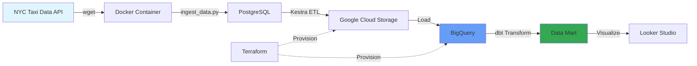

# 🚀 Data Engineering ZoomCamp 2026

My learning journey through the [Data Engineering ZoomCamp](https://github.com/DataTalksClub/data-engineering-zoomcamp) by DataTalksClub.

## 📌 Overview

This repository contains all my projects, homework solutions, and notes from the Data Engineering ZoomCamp 2026 cohort. The course covers end-to-end data engineering concepts from containerization to streaming data processing.

**Cohort:** 2026  
**Duration:** January - April 2026  
**Status:** In Progress 🏃

---

## 🛠️ Tech Stack

<div align="left">
  
**Cloud & Infrastructure:**  


**Orchestration & Workflow:**  


**Data Processing & Analytics:**  


**Streaming:**  


**Languages:**  


</div>

---

## 🗺️ Course Progress

- [x] **[Module 1: Containerization & Infrastructure as Code](#-module-1-containerization--infrastructure-as-code)** ✅
- [x] **[Module 2: Workflow Orchestration](#-module-2-workflow-orchestration)** ✅
- [ ] **[Workshop 1: Data Ingestion](#-workshop-1-data-ingestion)** 🚧
- [ ] **[Module 3: Data Warehousing](#-module-3-data-warehousing)**
- [ ] **[Module 4: Analytics Engineering](#-module-4-analytics-engineering)**
- [ ] **[Module 5: Batch Processing](#-module-5-batch-processing)**
- [ ] **[Module 6: Streaming](#-module-6-streaming)**
- [ ] **[Final Project](#-final-project)**

---

## 🏗️ Architecture Overview



**Data Flow:**
1. Raw data extracted from NYC TLC Data releases
2. Containerized ingestion pipeline loads to PostgreSQL
3. Kestra orchestrates data movement to GCS
4. BigQuery for data warehousing
5. dbt for transformation and modeling
6. Visualization in Looker Studio

---

## 📚 Module Details

### 📦 Module 1: Containerization & Infrastructure as Code

**Topics Covered:**
- Introduction to Google Cloud Platform (GCP)
- Docker fundamentals and containerization
- Running PostgreSQL and pgAdmin with Docker Compose
- Infrastructure as Code with Terraform
- Creating GCS buckets and BigQuery datasets

**Key Projects:**
- Dockerized data ingestion pipeline
- Terraform GCP infrastructure setup

**📁 Directory:** [`Module-1-Docker-Terraform/`](Module-1-Docker-Terraform/)

**🎯 Skills Gained:**
- Container orchestration with Docker Compose
- SQL data manipulation
- Cloud infrastructure provisioning

---

### ⚙️ Module 2: Workflow Orchestration

**Topics Covered:**
- Data Lakes concepts
- Workflow orchestration with Kestra
- ETL pipeline design
- Variables and dynamic expressions
- Scheduling and backfill strategies

**Key Projects:**
- Multi-source data ingestion flows
- Scheduled BigQuery data loading
- PostgreSQL to GCS pipelines

**📁 Directory:** [`Module-2-Kestra/`](Module-2-Kestra/)

**🎯 Skills Gained:**
- Building production-grade ETL workflows
- YAML-based pipeline configuration
- Monitoring and debugging data flows

---

### 🔄 Workshop 1: Data Ingestion

**Topics Covered:**
- API reading and data extraction
- Pipeline scalability patterns
- Data normalization techniques
- Incremental loading strategies

**Status:** Coming Soon 🚧

---

### 🏢 Module 3: Data Warehousing

**Topics Covered:**
- BigQuery fundamentals
- Partitioning and clustering strategies
- Query optimization
- Cost management
- Machine learning in BigQuery (BQML)

**Status:** Coming Soon

---

### 📊 Module 4: Analytics Engineering

**Topics Covered:**
- Analytics engineering principles
- Data modeling with dbt
- Testing and documentation
- CI/CD for analytics
- dbt with DuckDB & BigQuery

**Status:** Coming Soon

---

### ⚡ Module 5: Batch Processing

**Topics Covered:**
- Introduction to Apache Spark
- Spark DataFrames and SQL
- RDD operations
- Internals of GroupBy and Joins
- Performance optimization

**Status:** Coming Soon

---

### 🌊 Module 6: Streaming

**Topics Covered:**
- Introduction to Apache Kafka
- Kafka Streams
- KSQL for stream processing
- Schema management with Avro
- Real-time data pipelines

**Status:** Coming Soon

---

### 🎓 Final Project

**Objective:**
Apply all concepts learned to build an end-to-end data pipeline.

**Requirements:**
- Data ingestion from external source
- Orchestrated ETL workflows
- Cloud data warehouse
- Analytics transformations
- Dashboard visualization
- Peer review submission

**Status:** Coming Soon

---

## 🚀 Getting Started

### Prerequisites

```bash
# Required
- Docker & Docker Compose
- Python 3.9+
- Google Cloud account
- Terraform

# Optional
- pgcli for PostgreSQL
- VS Code with extensions
```

### Quick Setup

1. **Clone the repository:**
```bash
git clone https://github.com/gaoxinglin/DE-ZoomCamp
cd DE-ZoomCamp
```

2. **Set up GCP credentials:**
```bash
export GOOGLE_APPLICATION_CREDENTIALS="path/to/your/credentials.json"
```

3. **Navigate to specific module:**
```bash
cd Module-1-Docker-Terraform
# or
cd Module-2-Kestra
```

4. **Follow module-specific README for setup instructions**

---

## 📝 Homework Solutions

Each module contains detailed homework solutions with:
- Problem statements
- Step-by-step approach
- SQL queries / Code snippets
- Answers and explanations

| Module | Homework | Status | Link |
|--------|----------|--------|------|
| Module 1 | Docker & Terraform | ✅ Completed | [View](Module-1-Docker-Terraform/README.md) |
| Module 2 | Kestra Workflows | ✅ Completed | [View](Module-2-Kestra/README.md) |
| Workshop 1 | Data Ingestion | ⏳ Pending | - |
| Module 3 | BigQuery | ⏳ Pending | - |
| Module 4 | dbt | ⏳ Pending | - |
| Module 5 | Spark | ⏳ Pending | - |
| Module 6 | Kafka | ⏳ Pending | - |

---

## 🛠️ Environment & Versions

**Development Environment:**
- OS: macOS (Apple Silicon)
- Terminal: zsh
- IDE: VS Code

**Key Versions:**
```yaml
docker: 24.0+
docker-compose: 2.20+
terraform: 1.5+
python: 3.11+
postgresql: 16
kestra: latest
```

**GCP Services Used:**
- Google Cloud Storage (GCS)
- BigQuery
- Cloud Storage buckets

---

## 💡 Key Learnings & Insights

### Architecture Decisions

**Why Kestra over Airflow?**
- Simpler YAML-based configuration
- Better UI/UX for monitoring
- Native cloud storage integration
- Easier learning curve for beginners

**Docker vs Native Installation:**
- Docker ensures environment consistency
- Easy cleanup and version management
- Simulates production deployment

### Common Pitfalls & Solutions

#### 1. Docker Network Issues
**Problem:** Container can't connect to PostgreSQL  
**Solution:** Use service names from `docker-compose.yaml`, not `localhost`
```yaml
# Use this
host: db
# Not this
host: localhost
```

#### 2. GCP Authentication
**Problem:** Terraform/Python can't access GCP resources  
**Solution:** Set environment variable correctly
```bash
export GOOGLE_APPLICATION_CREDENTIALS="/absolute/path/to/credentials.json"
```

#### 3. Kestra Variable Rendering
**Problem:** Variables not rendering in flows  
**Solution:** Use double curly braces and `render()` function
```yaml
# Correct
file: "{{inputs.taxi}}_tripdata_{{inputs.year}}-{{inputs.month}}.csv"
```

#### 4. BigQuery Costs
**Problem:** High query costs  
**Solution:** 
- Use partitioned tables
- Avoid `SELECT *`
- Preview data with `LIMIT` first

---

## 📖 Additional Resources

**Official Course Materials:**
- [Course GitHub](https://github.com/DataTalksClub/data-engineering-zoomcamp)
- [Course Videos](https://www.youtube.com/playlist?list=PL3MmuxUbc_hJed7dXYoJw8DoCuVHhGEQb)
- [Slack Community](https://datatalks.club/slack.html)

**Tools Documentation:**
- [Kestra Docs](https://kestra.io/docs)
- [Terraform GCP Provider](https://registry.terraform.io/providers/hashicorp/google/latest/docs)
- [BigQuery Best Practices](https://cloud.google.com/bigquery/docs/best-practices)
- [dbt Documentation](https://docs.getdbt.com/)

**Datasets:**
- [NYC TLC Trip Record Data](https://github.com/DataTalksClub/nyc-tlc-data)

---

## 🤝 Contributing

This is a personal learning repository, but feel free to:
- Open issues for questions
- Suggest improvements
- Share your own solutions

---

## 📬 Connect

If you're also taking the course or interested in data engineering:

- GitHub: [@gaoxinglin](https://github.com/gaoxinglin)
- LinkedIn: [gaoxinglin](https://linkedin.com/in/gaoxinglin)
- Email: gaoxinglin@gmail.com
---

## 📜 License

This project is for educational purposes. Course materials belong to DataTalksClub.

---

## 🙏 Acknowledgments

Huge thanks to:
- [Alexey Grigorev](https://github.com/alexeygrigorev) - Course creator
- [DataTalksClub](https://datatalks.club/) - For providing free education
- All TAs and community members

---

<div align="center">

**⭐ Star this repo if you find it helpful!**

Made with ❤️ while learning Data Engineering

Last Updated: February 1, 2026

</div>
